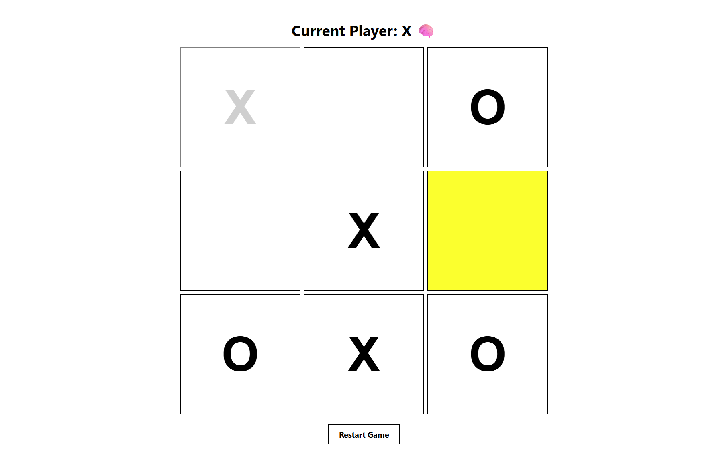

## Ultimate TicTacToe: FSAB Project

### 1. Overview:
TicTacToe implemented with fundamental rules of alternating turns, winner detection, and no overwriting on a 3x3 board. Additional rule added that only 3 X's and O's of each may exist at any time, adding an ultimate level of strategy.

### 2. How to Run It:
Ensure that Git and Node.js are properly installed on your system. Then, open a terminal and run:
- git clone https://github.com/ulqane/tictactoe
- cd ~/TicTacToe
- npm install
- npm run dev
Afterwards, open the local URL that was given in terminal (http://localhost:5173) to view the project.

### 3. Your Contribution:
Following the fundamental portion of the React tutorial...
- Added 3 piece capacity game rule with queue and reconstructed board state management beyond a static 9-element array
- Implemented fading visual indicator on board for a piece disappearing
- Added emoji indicators on win and randomized during turns
- Added highlights on hovering a position
- Added restart button + functionality
- Overhauled default CSS into simplistic, fresh theme with responsive scaling using clamp()
- Modularized codebase to be separate and encapsulated

### 4. What I Learned:
One thing I learned was how to effectively approach the mountain of CSS and understanding each component and what they do. 
The default boilerplate given by Vite had a dark theme and many complex variable settings that went unused or became unnecessary. There were a plethora of variables I could barely comprehend, and in having to cull what was needed along with reinstantiating them for my project, I gained a better grasp of the fundamental pieces needed to create a strong basis for a format. 

### 5. References:
I utilized the official React Tic-Tac-Toe tutorial (https://react.dev/learn/tutorial-tic-tac-toe) and the provided code blocks to guide the structure of my project. 